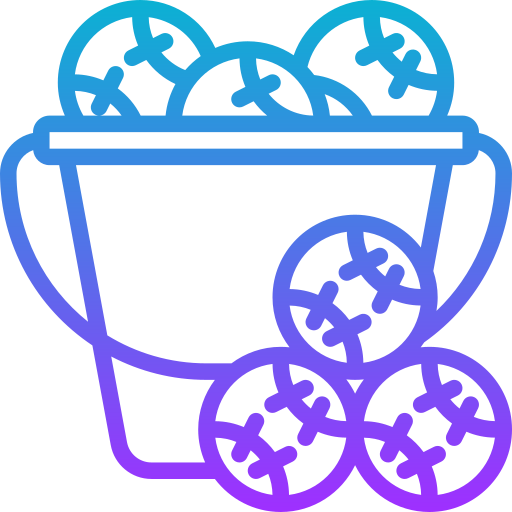

# Balls To Bucket WebApp 

Check it out! 👉🏼 [Balls To Bucket WebApp](https://adarshrajpathak.github.io/BallsToBucket-WebApp/) by [Adarsh Raj Pathak](https://github.com/adarshrajpathak)

_`Balls To Bucket` WebApp using jQuery, JavaScript, CSS, HTML_

## Overview

Simulate an automatic process of moving colorful balls to a bucket. Click the "Add Ball to Bucket" button to stack randomly colored balls in the bucket.

### Features

- **Dynamic Ball Addition**: Click the button to add a randomly colored ball to the bucket.
- **Random Color Selection**: Colors are randomly picked from a set.
- **Automatic Stacking**: Balls stack horizontally as they're added.
- **Flexible Bucket Size**: Bucket Size dynamically increases with increased no. of balls.

### Data Storage

- **`colorSpec`**: Array with colors: 'red', 'blue', 'yellow', 'lightgrey', 'darkorchid', 'black', 'orange', 'deeppink', 'green', 'purple', 'saddlebrown', 'lightseagreen', 'deepskyblue', 'firebrick', and 'crimson'.

### Structure

- **`index.html`**: Structure and layout of the web page.
- **`style.css`**: Styling of the elements.
- **`script.js`**: Functionality using jQuery(via CDN).